# Sprint 3 Worksheet

## 1. Load Testing

### Load Test Tool: K6

- We use K6 to run load tests on our API as it is a highly-regarded tool within the developer community, and it allows us to create tests by writing code which comes naturally to us.

### Setting up Load Test Environment

1. Run the API using the Docker commands listed in the [README.md in the /server folder](/server/README.md).
2. Once the API is running, you can run load tests by running the command `docker run --rm -i grafana/k6 run - <script.js`, where `script.js` is the K6 load test file you are running.

### Providing Context for How K6 Works

- When describing the test cases, we will often be using terms like “ramping up” and ramping down”. To give an explanation of what that means in a K6 load test, we have provided an image. In this image, you can see the number of VUs (which means Virtual User) increases second by second. When a virtual user is active, all it will do is repeat the test over and over. For example, a test could be something like registering an account, which means a virtual user will spam the register endpoint until it is deactivated. This explains why even when you have 10 VUs, as shown in the third second of the load test, there have already been 175 requests completed. 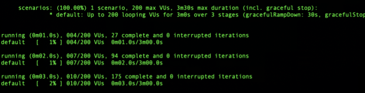

### Test Cases

**User Registration**

- When the site gets released, we anticipate there will be a lot of citizens that are eager to sign up.
- Thus, we created a load test testing the POST /apis/v1/users endpoint that ramps up to 200 users over the course of a minute, ramps down to 100 users over the course of the next minute, and ramps down again to 50 users over the course of a minute.
  - We decided to go for this ramp-up then ramp-down approach, as there will likely be a large wave of people that were waiting for the site to release, then it will slowly die down.

**Post and Comment Creation and Main Interactions**

- We decided to test one of the main workflows for the forum, which is a user registering (POST /apis/v1/users), logging in (POST /apis/v1/authentication/login), creating a post (POST /apis/v1/posts), voting on a post (PUT /apis/v1/posts/{postId}/votes), creating a comment (POST /apis/v1/posts/{postId}comments), and voting on a comment (PUT /apis/v1/comments/{commentId}/votes).
- Our load test has 125 users over the course of 2 minutes, which aligns with our non-functional performance feature.

**Getting Posts**

- Since the most important request that is made when you load the home page is getting posts (GET /apis/v1/posts), we decided to create a load test calling this endpoint that has 200 users over the course of 2 minutes to stress our system.
- Before running the test, we seeded the database using the populate_posts.sql file in the /server directory. This script creates over 300 posts in the database.

### Test Reports

**User Registration**

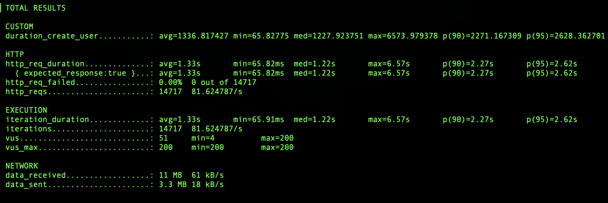

**Post and Comment Creation and Main Interactions**

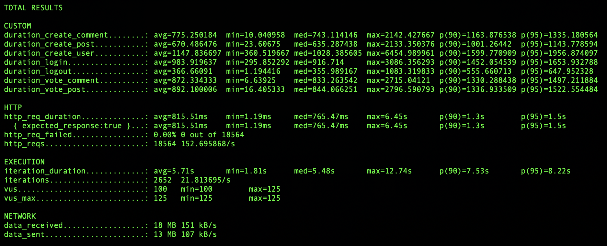

**Getting Posts**

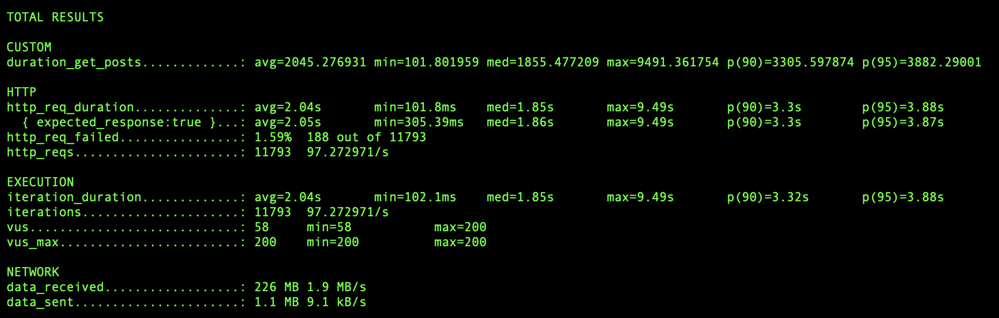

### Bottleneck

- For the “Getting Posts” test case, we were able to serve 11793 requests in the span of two minutes, but we unfortunately had 1.59% of those requests failing.
- We investigated and found that in the logs for our PostgreSQL Docker container, we seemed to have been getting too many simultaneous connections to the database. 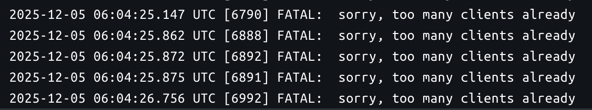

### Non-Functional Requirements

- For our non-functional feature, we increased the load requirements to “handle 125 users with 1250 concurrent requests per minute.” As seen in the test reports, we were able to far exceed those requirements.
- However, we would have to look into solving the issue we ran into for the “Getting Posts” test case, as ideally we would have 0 request failures.
  - In regards to solving this issue with more resources/money, we likely could just beef up our database server and increase the number of connections that it can take. However, we likely can solve the issue without spending more on resources by adjusting how the database connection pooling works in our API server to ensure we never exceed the limit.

## 2. Security Analysis

### Security Analysis Tool

- We used _SonarQube Cloud_, which is provided by Sonar as our static/security analysis tool.
- Running the analysis was simple, as all we needed to do was provide SonarQube access to our GitHub repo through GitHub’s authentication. It was then able to analyze our repository automatically. We were then able to view a dashboard and all reports using SonarQube’s Cloud web interface.
  - We set the tool up so that it will run its analysis on every new commit to main. Because SonarQube is integrated within our GitHub repository, it analyzes all of the languages used in our codebase.

### Static Analysis Report

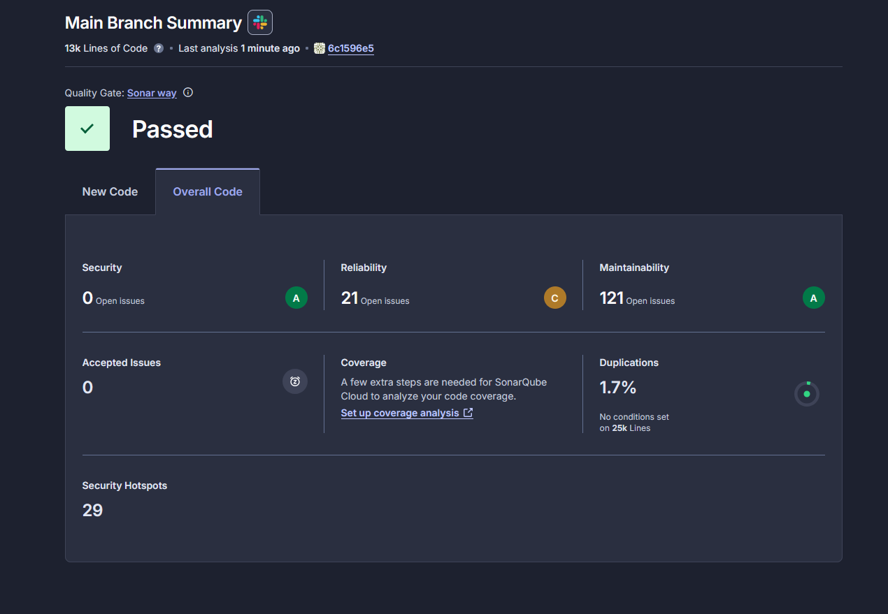

### Detected Problems

- High Priority
  - One high/severe security vulnerability it detected was that we have our postgres database connection details hardcoded in a json file. This included the username and password.
  - It also detected hardcoded passwords in our test files, as we had to mock user credentials (username & password) for our tests to create mock users and believed this to be a high security risk. Because these are just mock testing passwords, we believe this to be a false flag. This is because these passwords are not being used for database, API, file storage, and other potentially vulnerable access points in a production environment. 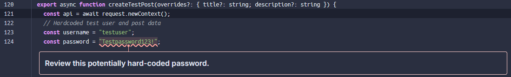
- Medium Priority
  - It detected that a regex string that was used in the map overview code in the frontend could potentially lead to a denial-of-service. According to SonarQube, this is because the regex could be vulnerable to super-linear runtime due to backtracking. 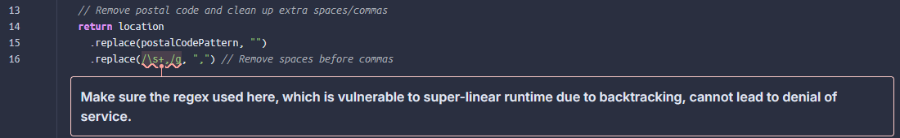
  - It detected that we are recursively copying everything from the build context into the current directory in the Docker image. This is because we do: COPY . . in our Dockerfiles. This could potentially expose sensitive data in our Docker images. 
- Low Priority
  - It is warning us that running our .NET app over clear-text HTTP could potentially be unsafe. 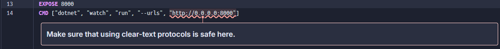

### Handling High Vulnerability

Fixing the high vulnerability from storing hardcoded Postgres database credentials in files tracked by Git. These are now moved to a secure .env.development file that is not tracked by Git.

[This is the commit the vulnerability was fixed in](https://github.com/Our-City/OurCity/commit/378fc574b47ec872e95459073e55aa26b3ee2cef)

### Other Issues

While we didn’t have many high security vulnerabilities, SonarQube also provides codebase maintainability/reliability analysis as well. It is able to detect bugs and code smells within the codebase. There were some prominent bugs it detected. We will go over two of them.

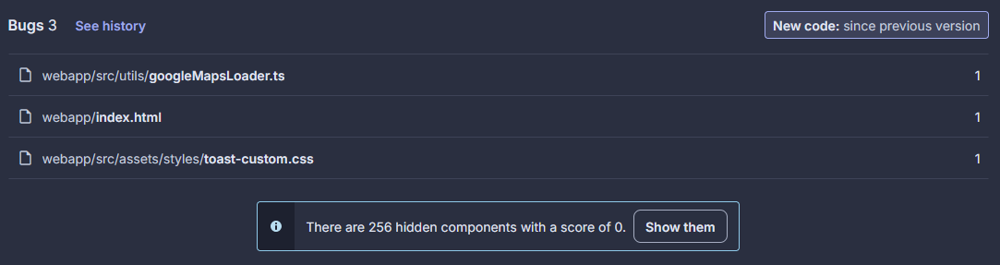

1. One problem it detected was that our index.html file does not specify a “lang” attribute in the <html> element. According to SonarQube, this lang attribute is used by assistive technologies, search engines, and translation tools to correctly interpret text. 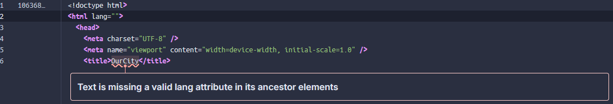
2. Another problem it detected was that we misuse a JavaScript Promise in googleMapsLoader.ts because the Promise object is used in a conditional block, which does not make sense because the object itself will always return a truthy value. Checking the Promises’ resolved value instead would be the correct choice. 

## 3. Continuous Integration & Deployment (CI/CD)

Our project uses GitHub Actions for both Continuous Integration and Continuous Deployment.

- Continuous Integration (CI):
  - Automatically runs on every push to main and on all pull requests
  - Executes linting, formatting checks, and tests for both frontend (Vue.js) and backend (.NET)
    - Frontend: Runs Vitest tests and type-checking
    - Backend: Runs XUnit unit and integration tests
  - Ensures code quality and prevents broken code from being merged
- Continuous Deployment (CD):
  - Manually triggered workflow via GitHub Actions
  - Builds and pushes Docker images to DockerHub for:
    - Frontend (itsmannpatel/ourcity-frontend)
    - Backend (itsmannpatel/ourcity-backend)
    - Migration runner (itsmannpatel/ourcity-migrate)
  - Images are tagged with Git commit SHA for traceability
  - Enables reproducible deployments by specifying the TAG environment variable in docker-compose commands

Here are our links for the CI/CD pipeline. Within the provided links, there should also be hyperlinks to the .yml files we used to create the pipelines.

- [CI](https://github.com/Our-City/OurCity/actions/workflows/ci.yml)
- [CD](https://github.com/Our-City/OurCity/actions/workflows/cd.yml)

**CI Snapshot**

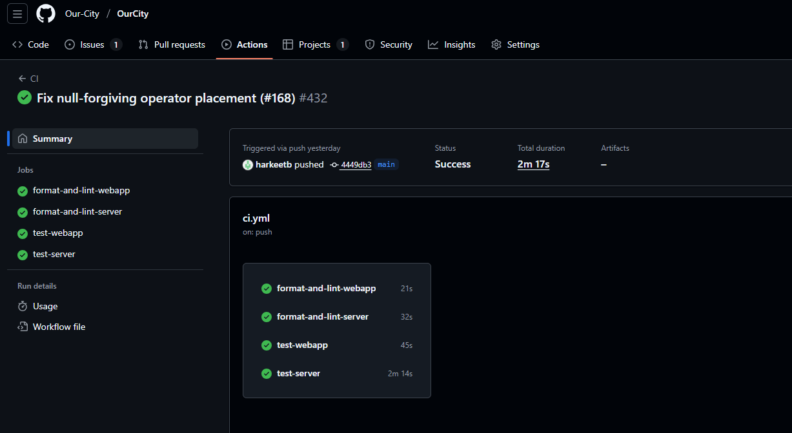

**CD Snapshot**

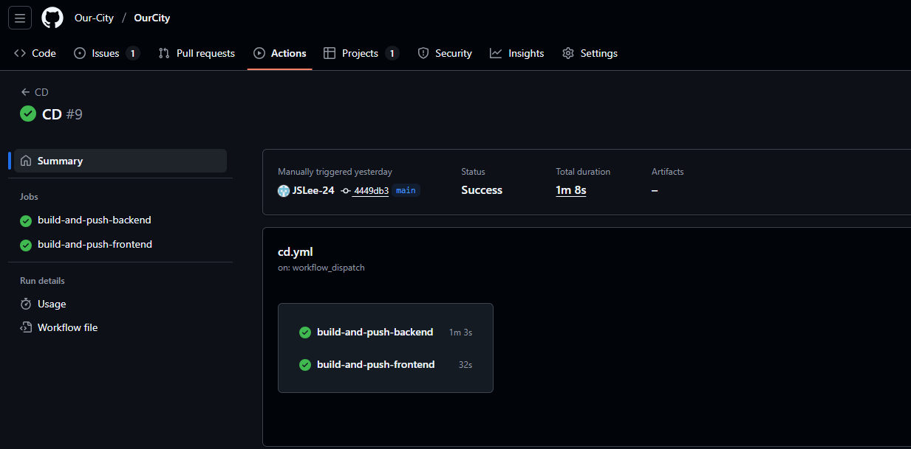

## 4. Reflections

### Design Changes

One point about the design that could be changed going back is with the error handling across the whole project. With the backend, we end up returning string error messages. Using a library like OneOf from the very start would have been better so service return types could have been, for example, OneOf<Post, PostNotFoundError, UnauthorizedError>. In the frontend, most of the time, it uses more general exceptions for error handling rather than specific errors, so components can really only display error messages rather than handle the different error types as needed. These changes would provide more safety for our app and remove having to basically do string comparisons to determine what the HTTP status codes are. In general, we don’t want to be treating all errors the same way, so we should have accounted for that.

### Project Setup Changes

One thing that could be changed about the course is more closely tying the course content to the project outcomes and requirements. Both the course content and project provided great learning opportunities, but they felt disjoint at times. One specific change that could be made to the project requirements is utilizing one of the strategies seen in class to prioritize tests in the CI pipeline. A potential addition to the course content that would tie in to the project would be a section on choosing a tech stack. Some changes like this would help the project feel more cohesive.

### Individual AI / External Resource Reflections

- Will
  - I used AI to assist with my development throughout the project, mostly with Claude Sonnet 4.5 in Copilot within VSCode. One specific thing I used Copilot for was setting up chart data and chart options boilerplate code for the admin dashboard. I used CoreUI’s implementation of chart.js for the dashboard, and this library requires significant boilerplate setup. Copilot did a good job of setting this up without me needing to learn the ins and outs of the library. I also had Copilot put together mock data to fill the chart for initial development. I then replaced the colours for the charts and wrote the logic for pulling the data. I learned that AI is pretty good at writing boilerplate code, likely since it can be easily compiled from documentation.
- Mann
  - I used GitHub Copilot extensively when developing the map visualization features in MapOverview.vue. For example, when implementing the heatmap layer functionality, I asked Copilot to help with creating weighted location data points and styling the gradient. Copilot generated the basic structure for the initHeatmap() function and suggested the gradient color array, but I had to validate that the weighted locations were calculated correctly by testing with actual post data. I also asked Copilot for help with CSS styling for the map controls and toggle buttons, which it provided good boilerplate for, but I refined the styling to match our application's design system using our CSS variables. Additionally, when implementing the marker toggle functionality, Copilot suggested the initial approach, but I had to debug and rewrite parts of the toggleMarkers() function to properly handle the map state. Through this process, I learned how to better structure my prompts to get more accurate responses and developed a stronger understanding of the Google Maps API, particularly around the visualization library and advanced markers.
- Andre
  - I used AI a decent amount throughout the course of this project. One notable problem I tried to solve was how to create integration tests that would test the whole endpoint pipeline (i.e. HTTP routing, middleware, service layer, etc), as I was not sure how to do it in .NET. Immediately, it showed how to combine Testcontainers and a WebApplicationFactory to create instances of our API that could be used during tests. By asking AI questions throughout this process about things I was unsure about, I learned some intricacies about .NET and Testcontainers, which I am grateful for since these tools are common in the industry. For example, when I was creating the CI pipeline, Testcontainers was breaking when I was running tests, and I learned I had to manually provide a Docker socket for them to work (since Testcontainers is based on Docker).
- Jade
  - I used AI (Github Copilot) as a tool to shorten development time for simple tasks. They were mainly used to autocomplete general skeleton codes for endpoint (controllers), ORM uses for data fetching (repository), and test methods. When a base skeleton code was generated, I modified the code to meet only necessary needs. For example, a sample query will be written, and I would go through, modifying and ensuring that they fetch exactly what we need. Similarly for testing, if it suggested me with a sample test for an existing method, I would use it as a skeleton, replace variables and method parameters to use our test variables, and to test exactly what I intended to. I also did use Claude to create a more robust set of relatively more complex tests such as integration tests. The generated responses allowed me to go through a working set of tests using our tech stack. This allowed me to better understand how the structuring works, which were used to help create future test methods.
- Harkeet
  - I used AI (specifically GitHub Copilot) to see if it would help improve efficiency and productivity, as it has been advertised to do so. One task I used AI for was to write end-to-end tests, as I personally find that writing tests can become quite tedious (and boring) even though it is an important part of the SDLC. The way I used Copilot to assist me with test writing was to provide it with a list of user workflow cases I would want it to test, and then allow it to write the skeletons for the tests. It would do a good job of producing correct syntax and adhering to the test cases it was supposed to write. However, I would still have to change some tests here and there as certain tests that the agent would produce would fail due to it writing the wrong CSS class names when trying to locate certain UI elements such as buttons, dropdowns, etc. I found that providing Copilot with context to the Vue components that I needed to write tests for helped mitigate this, as it can learn from the actual component files to see what the actual CSS classes names are, etc. I learned that agent tools like Copilot can actually assist quite well with more repetitive tasks such as testing, but they won’t always produce the correct results on the first go if they don’t have the necessary context, so I’d say human intervention is still mandatory in AI-assisted development.
- Nathan
  - I used CoPilot to help me with styling and creating the layout of the frontend for the post detail page as I hadn’t worked on any frontend work in a while. I would ask for small edits such as “how can I move this button here?”, “how can I center this content?”, or “how can I make the text look like this?” Generally, it was able to complete these smaller requests quite well and provided me with a decent setup. Using its template code, I could adjust it slightly as needed and also be able to reuse the code for other parts of our app. After using it a few times asking for the similar requests, I was able to pick up some patterns and was able to figure out how to make some of the changes without its help.
